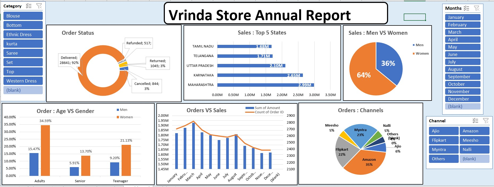

# 🛍️ Vrinda Store Sales Analysis Dashboard

---

## 📌 Project Overview

This project presents an **Interactive Sales Analysis Dashboard** built to analyze Vrinda Store's retail sales performance across customers, sales channels, order status, and geographic regions.

The dashboard provides business insights into customer demographics, sales distribution, and channel performance to support data-driven decision-making.

---

## 🏷 Project Badges

---

## 📊 Dataset Description

Each row represents a single customer order transaction.

### Columns Included:

- index  
- Order ID  
- Cust ID  
- Gender  
- Age  
- Age Group  
- Date  
- Months  
- Status  
- Channel  
- SKU  
- Category  
- Size  
- Qty  
- currency  
- Amount  
- ship-city  
- ship-state  
- ship-postal-code  
- ship-country  
- B2B  

---

## 🧹 Data Preparation & Processing

The following steps were performed:

- Cleaned inconsistent categorical values  
- Created age groups for demographic analysis  
- Standardized date and month fields  
- Verified order status categories  
- Built calculated sales metrics  

---

## 📈 Key Performance Indicators (KPIs)

The dashboard includes:

- **Total Sales**
- **Total Orders**
- **Total Quantity Sold**
- **Sales by Gender**
- **Top Performing States**

---

## 📊 Dashboard Features

### 🔎 Interactive Filters (Slicers)

- Category  
- Months  
- Channel  

All visualizations dynamically update based on filter selections.

---

## 📉 Visualizations Included

- Order Status Distribution  
- Sales – Top 5 States  
- Sales: Men vs Women  
- Order Age Group vs Gender  
- Order vs Sales Trend  
- Orders by Sales Channel  

---

## 🔍 Key Business Insights

- Certain states contribute significantly to total revenue  
- Female customers may generate higher/lower sales (based on data)  
- Specific age groups dominate purchasing activity  
- Online channels outperform others in order volume  
- Order status analysis highlights fulfillment performance  

---
## 📊 Dashboard Preview

## 🛠 Tools & Technologies Used

- Microsoft Excel / Power BI  
- Pivot Tables / Data Modeling  
- Data Cleaning  
- Interactive Slicers  
- Dashboard Design  

---

## 🎯 Business Value

This dashboard enables stakeholders to:

- Identify high-revenue states  
- Understand gender and age purchasing behavior  
- Evaluate channel performance  
- Monitor order fulfillment status  
- Improve marketing targeting strategies  

---

## 🚀 Why This Project is Valuable

- Combines sales + customer demographics  
- Includes geographic performance analysis  
- Provides channel-level insights  
- Supports strategic retail decisions  

---

## 👨‍💻 Author

**Atharva Waikar** - Data Analyst  
Excel | Power BI | SQL | Data Analytics  

---

⭐ If you found this project insightful, consider giving it a star!
